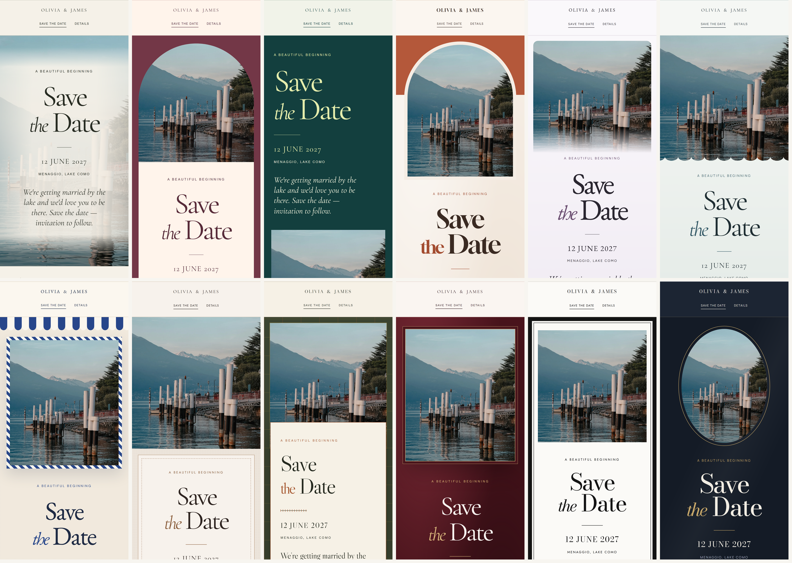
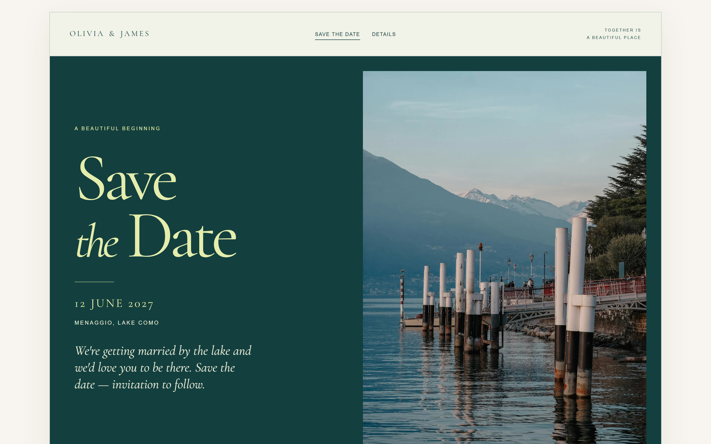
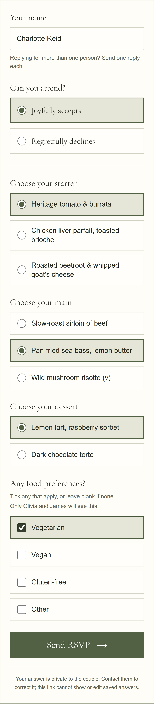
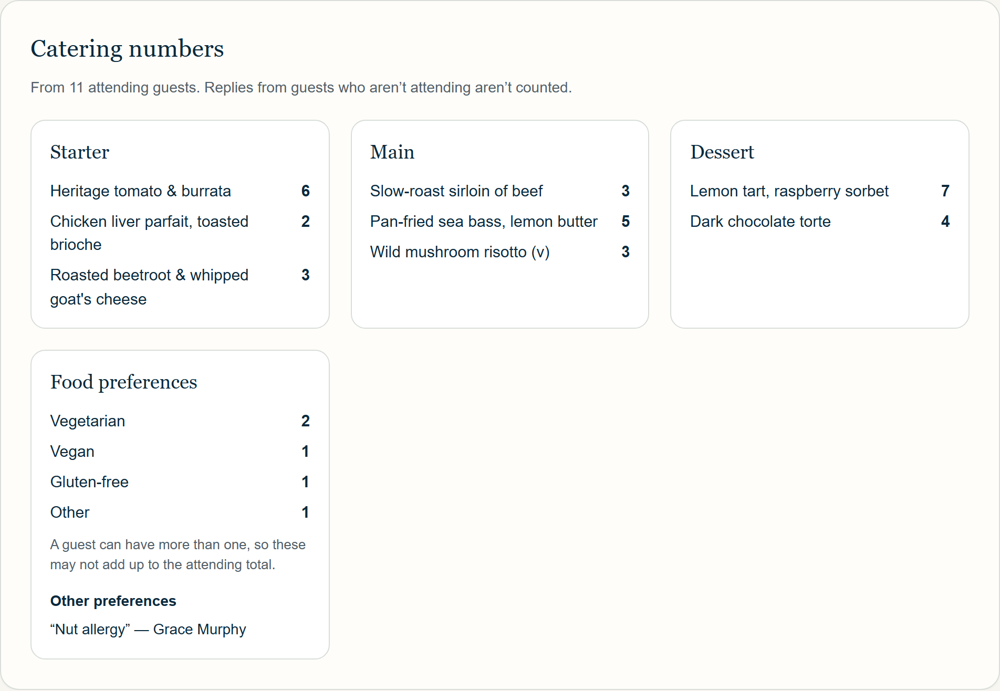

# SaveTheDates: what to show off, with screenshots

A guide for the marketing team. It covers what the product does, which features are worth showing, what we can and can't claim, and where the screenshots are.

All screenshots are in [`../images/`](../images/) (258 images). They were captured on **28 September 2026** from the current application code, which is what runs on the live site at **https://savethedates.co.uk**. The price shown is **£19**: the screenshots that show it (the marketing pages, their homepage sections, and the publish-and-pay screen) were re-captured on 29 September 2026 after the price change.

Every name, date, guest and reply in the screenshots is **fictional**.

---

## 1. At a glance

| | |
| --- | --- |
| **What it is** | A private wedding website for each couple, with up to four pages: Save the Date, Invitation, Details and RSVP. |
| **Who it's for** | Couples planning a wedding, mainly in the UK and Ireland. |
| **Price** | **£19, paid once** when the couple is ready to publish. No subscription. Building and previewing is free. |
| **How long it stays online** | Until six months after the wedding date. That date is based on the wedding date at checkout and fixed when checkout starts. |
| **Designs** | Twelve. Each has a matching Save the Date, Invitation, Details and RSVP. |
| **How guests get it** | A private link, sent by WhatsApp, text or email. Guests need no app and no account. |
| **Refunds** | Full refund within 14 days of paying, for any reason. |
| **Live site** | https://savethedates.co.uk (launched 26 September 2026) |
| **Contact** | hello@savethedates.co.uk |

**The core promise** (from the live homepage): *"Your wedding website, beautifully done."*

---

## 2. Approved messaging

These lines are already live on the website, so you can use them word for word. Copy that goes beyond them must stay within the rules in [section 9](#9-what-we-can-and-cant-say).

**Headlines**

- Your wedding website, beautifully done.
- From Save the Date to final RSVP.
- Made for your kind of forever.
- Find your kind of beautiful. (twelve designs)
- RSVPs without the spreadsheet chaos.
- Save the date first. Invite them later.
- Digital save the dates, with RSVP built in.
- Everything your guests need, in the design you love.
- Simple to share. Private to you.
- Make something worth sharing.
- A beautiful beginning, shared.

**Supporting lines**

- Your Save the Date, wedding invitation, details and RSVPs, including meal choices and dietary requirements, on one private wedding website. Send each by WhatsApp, text or email, when the time is right.
- Free to build and preview. £19 once when you're ready to publish.
- No subscription · No app or login for guests · Twelve designs
- Guests confirm whether they're coming, choose their starter, main and dessert, and tell you about dietary requirements, all online and without creating an account. Every reply lands privately in your guest list.
- Meal numbers ready to send to your caterer.
- No layouts to design and nothing to configure.
- There are no envelopes, stamps or postal addresses to collect.
- Change of plan? Same links. Saved changes show on your published site, so guests always see the latest version.
- Posting printed invitations instead? Leave this page off.

**What £19 includes** (the live pricing list, word for word):

- All twelve wedding website designs, with a photo of your choice
- Save the Date and wedding invitation
- Wedding details: times, venues, travel, where to stay and FAQs
- Online RSVPs with meal choices
- Dietary requirements collected with each RSVP
- Private links for your Save the Date and Invitation
- Private guest list, attendance totals and catering numbers
- Published until six months after your wedding date*

\*Based on the wedding date at checkout. Your expiry date is fixed when you start checkout.

---

## 3. The features to show off

These are ranked by how much they sell the product. Each one lists what it does, why couples care, facts you can state, and the best images to use.

### 3.1 Twelve designs, one look from start to finish (lead feature)

**What it does:** The couple picks one of twelve designs. Their Save the Date, Invitation, Details and RSVP all use it. They can switch design at any time, and nothing changes for guests until they apply it.

**Why couples care:** It looks like a designed, printed stationery suite, not a website builder. There's nothing to lay out.

**Facts you can state:** Twelve designs. Each has a matching Save the Date, Invitation, Details and RSVP. Couples can try every design with their own words and photo before paying.

| # | Design | Official description | Look and feel |
| --- | --- | --- | --- |
| 01 | Modern Minimal | Calm sage, warm paper and timeless typography. | Olive branch, soft light |
| 02 | Warm & Romantic | Soft cream, muted rose and intimate photography. | Garden rose, arched photo |
| 03 | Modern & Bold | Deep teal, strong photography and editorial type. | Magazine-style, citrus |
| 04 | Terracotta | Sun-baked clay, olive branches and linen. | Mediterranean, arched frame |
| 05 | Heather | Misty lilac, moorland heather and slate. | Irish/Scottish moorland |
| 06 | Coastal | Sea glass, driftwood and sea holly. | Wave-edged photo |
| 07 | Riviera | Linen, Riviera blue stripes and lemons. | Striped awning, Italian summer |
| 08 | Alcantara | Soft suede, cognac and deep espresso. | Tone-on-tone luxury, no florals |
| 09 | Countryside | Oatmeal tweed, loden green and bracken. | Heritage British estate |
| 10 | Velvet | Claret velvet, blush paper and gold ribbon. | Rich, winter, gold hairlines |
| 11 | Black Tie | Black grosgrain, ivory letterpress and orchids. | Formal letterpress |
| 12 | Evening Gold | Midnight navy, candlelight and champagne. | The only dark design |

**Best images**

- [`07-theme-grids/all-12-themes-save-the-date-mobile-grid.png`](../images/07-theme-grids/all-12-themes-save-the-date-mobile-grid.png): all twelve Save the Dates side by side, from real screenshots. Also available for [invitation](../images/07-theme-grids/all-12-themes-invitation-mobile-grid.png), [details](../images/07-theme-grids/all-12-themes-details-mobile-grid.png) and [RSVP](../images/07-theme-grids/all-12-themes-rsvp-mobile-grid.png).
- `02-guest-pages-by-theme/<nn-theme>/save-the-date-mobile.png`: one phone screen per design, ideal for a 12-slide carousel.
- [`01-marketing-site/sections/home-section-twelve-designs-desktop.png`](../images/01-marketing-site/sections/home-section-twelve-designs-desktop.png): the homepage design gallery.
- [`04-couple-workspace/theme-preview/`](../images/04-couple-workspace/theme-preview/): the couple flicking through designs in the private preview ("Theme 10 of 12").

### 3.2 A Save the Date that opens on any phone

**What it does:** Shows the couple's names, date, location, optional photo and a short note. It's the first thing guests see.

**Why couples care:** It can go out the day the date is set, with no printing, postage or collecting addresses.

**Facts you can state:** Share it by WhatsApp, text or email. Guests open it on their phone, with nothing to download.

**Best images:** `02-guest-pages-by-theme/*/save-the-date-mobile.png` (phone) and `save-the-date-desktop.png` (laptop). The strongest are Modern Minimal, Modern & Bold, Riviera, Velvet and Evening Gold.

### 3.3 The wedding invitation (optional, on its own link)

**What it does:** A formal invitation card in the same design, with the couple's own wording, the date with its weekday, the ceremony time, the venue and an "afterwards" line. It has a separate link, so it can be sent months after the Save the Date. It asks guests to reply by the RSVP date and links to the RSVP.

**Why couples care:** It works for every kind of couple. Those posting printed invitations just leave it off, and the Save the Date and Details still work alongside the printed ones.

**Facts you can state:** Optional. Own wording. Own link. Works alongside printed invitations.

**Best images:** `02-guest-pages-by-theme/02-romantic/invitation-mobile.png`, `10-velvet/invitation-mobile.png`, `11-black-tie/invitation-mobile.png`, and [`03-guest-rsvp-journey/1-invitation-mobile.png`](../images/03-guest-rsvp-journey/1-invitation-mobile.png).

### 3.4 Wedding details: the questions guests always ask

**What it does:** One page with ceremony and reception times and venues, directions links, travel, where to stay, dress code and up to five FAQs. Empty sections don't appear.

**Why couples care:** Fewer repeated questions in the group chat. Update it once and everyone sees the latest version.

**Best images:** `02-guest-pages-by-theme/*/details-mobile-full.png` (the full scrolling page, good for scroll videos), and [`04-couple-workspace/feature-crops/details-faqs-editor.png`](../images/04-couple-workspace/feature-crops/details-faqs-editor.png) for how easy it is to fill in.

### 3.5 Online RSVP with meal choices and dietary requirements (guest side)

**What it does:** Each guest types their name and chooses "Joyfully accepts" or "Regretfully declines". If the couple has added a menu, attending guests choose a starter, main and dessert. Everyone attending can tick vegetarian, vegan or gluten-free, or type another need. The guest then sees a "Thank you" with a summary of their choices.

**Why couples care:** No chasing, no paper reply cards, and meal choices collected at the same time.

**Facts you can state:** No account or app for guests. Menus are optional, with 2 to 6 options per course, and a course with no options isn't shown. Guests can't see each other's replies. One reply per person; a "Reply for someone else" button lets a guest send a separate reply for a partner.

**Best images (this is the best sequence for a Reel or Story):**

1. [`03-guest-rsvp-journey/1-invitation-mobile.png`](../images/03-guest-rsvp-journey/1-invitation-mobile.png): the invitation
2. [`2-rsvp-start-mobile.png`](../images/03-guest-rsvp-journey/2-rsvp-start-mobile.png): the RSVP page
3. [`3-rsvp-filled-in-mobile.png`](../images/03-guest-rsvp-journey/3-rsvp-filled-in-mobile.png): name, accepts, starter, main, dessert and vegetarian ticked
4. [`4-rsvp-sent-mobile.png`](../images/03-guest-rsvp-journey/4-rsvp-sent-mobile.png): "Thank you", with the choices listed

### 3.6 Catering numbers and a private guest list (couple side)

**What it does:** Every reply lands in the couple's private Guests page. It shows response, attending and not-attending totals, a count of each starter, main and dessert, the dietary needs, and each guest's choices. The couple can search, filter and privately correct or remove replies.

**Why couples care:** This is the "RSVPs without the spreadsheet chaos" moment, with numbers ready to send to the caterer.

**Best images:**

- [`04-couple-workspace/feature-crops/guests-catering-numbers.png`](../images/04-couple-workspace/feature-crops/guests-catering-numbers.png): the strongest single image for this message
- [`04-couple-workspace/7-guests-desktop-full.png`](../images/04-couple-workspace/7-guests-desktop-full.png) and [`7-guests-mobile.png`](../images/04-couple-workspace/7-guests-mobile.png)
- [`04-couple-workspace/feature-crops/guests-response-list.png`](../images/04-couple-workspace/feature-crops/guests-response-list.png)
- [`04-couple-workspace/feature-crops/rsvp-meal-choices-menu.png`](../images/04-couple-workspace/feature-crops/rsvp-meal-choices-menu.png): the couple adding their menu

**Pairing idea:** Put the guest's phone (3.5) next to the couple's catering numbers. The live [What we offer](https://savethedates.co.uk/what-we-offer) page does this interactively; see [`01-marketing-site/sections/what-we-offer-try-the-rsvp-desktop.png`](../images/01-marketing-site/sections/what-we-offer-try-the-rsvp-desktop.png).

### 3.7 Send it on WhatsApp, with the message already written

**What it does:** When the site is live, the couple gets a Save the Date link, an Invitation link and an RSVP link. Each comes with a ready-written message they can edit, plus **Share on WhatsApp**, **Copy message** and **Copy link** buttons (and the phone's own share menu where available).

**Why couples care:** This is how people already talk to their guests. There are no envelopes, stamps or addresses.

**Facts you can state:** Two private links (Save the Date, and Invitation), so they can be sent months apart, plus a direct RSVP link for chasing late replies. The example message is *"Save the date! Olivia & James are getting married on 12 June 2027 at Menaggio, Lake Como. Find out more: <link>"*.

**Best images:** [`04-couple-workspace/feature-crops/share-save-the-date-panel.png`](../images/04-couple-workspace/feature-crops/share-save-the-date-panel.png), [`share-invitation-panel.png`](../images/04-couple-workspace/feature-crops/share-invitation-panel.png), [`share-rsvp-link-panel.png`](../images/04-couple-workspace/feature-crops/share-rsvp-link-panel.png).

**Link previews:** When a guest link is shared, the chat preview shows the couple's names and date with a card in their design. These are the real cards: [`06-link-preview-cards/`](../images/06-link-preview-cards/) (1200×630, one per design). The preview never shows the couple's photo or location.

### 3.8 Your photo, framed properly on phone and laptop

**What it does:** The couple uploads one photo (JPEG, PNG or WebP; large photos are shrunk on the device before upload). They can drag and zoom to frame it separately for the Save the Date and Details, with side-by-side phone and desktop previews. The site also looks finished without a photo.

**Best image:** [`04-couple-workspace/feature-crops/design-photo-and-framing.png`](../images/04-couple-workspace/feature-crops/design-photo-and-framing.png)

### 3.9 Try it all before paying

**What it does:** Couples build everything and preview every design with their own words and photo in a private preview. They only pay when they want guests to see it.

**Best images:** [`04-couple-workspace/theme-preview/`](../images/04-couple-workspace/theme-preview/) ("Private preview", "Preview only — this theme has not been applied") and [`05-getting-started/4-publish-and-pay-desktop.png`](../images/05-getting-started/4-publish-and-pay-desktop.png) (the £19 card on the Publish page of a draft wedding).

### 3.10 A calm, simple workspace for the couple

**What it does:** Eight clear sections: Overview, Basics, Design, Invitation, Details, RSVP, Guests and Publish. The Overview shows site status, a countdown to the wedding, RSVP totals, the share panels and the latest replies. It works on a phone, with a "Sections" menu.

**Best images:** [`04-couple-workspace/1-overview-desktop.png`](../images/04-couple-workspace/1-overview-desktop.png), [`feature-crops/overview-status-countdown-rsvp-cards.png`](../images/04-couple-workspace/feature-crops/overview-status-countdown-rsvp-cards.png) (Published · 257 days to go · 12 responses), [`04-couple-workspace/mobile-sections-menu-open.png`](../images/04-couple-workspace/mobile-sections-menu-open.png).

### 3.11 Private by design

**Facts you can state:**

- Wedding pages are marked not to appear in search engines.
- Each wedding's links contain a long private code, so they can't be guessed.
- Anyone with a link can open the pages it opens, so couples should share it only with their guests.
- Only the couple can see replies. Guests can't see each other's answers, and the RSVP link can't show or edit saved replies.
- Couples can replace a link at any time, which stops every earlier copy working, or unpublish the site.

### 3.12 Getting started takes a minute

Sign up with Google or with an email and password. The couple adds their names, date and location and starts a private draft straight away.

**Best images:** [`05-getting-started/1-create-account-mobile.png`](../images/05-getting-started/1-create-account-mobile.png) ("A little beginning."), [`3-new-wedding-overview-desktop.png`](../images/05-getting-started/3-new-wedding-overview-desktop.png) (a new draft wedding).

---

## 4. The story in order (for videos and carousels)

The natural storyline follows a real wedding timeline:

1. **Date's set:** choose a design → [`04-couple-workspace/theme-preview/`](../images/04-couple-workspace/theme-preview/)
2. **Send the Save the Date:** WhatsApp panel → [`share-save-the-date-panel.png`](../images/04-couple-workspace/feature-crops/share-save-the-date-panel.png), then the guest's phone → `02-guest-pages-by-theme/*/save-the-date-mobile.png`
3. **A few months to go, send the invitation:** → `02-guest-pages-by-theme/*/invitation-mobile.png`
4. **Guests check the details:** → `details-mobile-full.png` (scroll)
5. **Guests RSVP and choose their meal:** → [`03-guest-rsvp-journey/`](../images/03-guest-rsvp-journey/) steps 1–4
6. **The couple sees the numbers:** → [`guests-catering-numbers.png`](../images/04-couple-workspace/feature-crops/guests-catering-numbers.png)
7. **End card:** £19 once, no subscription → [`home-section-pricing-mobile.png`](../images/01-marketing-site/sections/home-section-pricing-mobile.png)

---

## 5. The showcase wedding (keep generated content consistent)

The public examples on the website use the same fictional couple, so keep to these details:

| | |
| --- | --- |
| Couple | **Olivia & James** (fictional) |
| Date | Saturday 12 June 2027 |
| Location | Menaggio, Lake Como |
| Note to guests | "We're getting married by the lake and we'd love you to be there. Save the date — invitation to follow." |
| Ceremony | 2:00 pm, The Lakeside Garden |
| Reception | 5:00 pm until late, dinner and dancing on the terrace |
| Invitation wording | "Together with their families … request the pleasure of your company at the celebration of their marriage. Dinner and dancing to follow on the terrace." |
| RSVP by | 30 April 2027 |
| Menu | Starters: Heritage tomato & burrata / Chicken liver parfait, toasted brioche / Roasted beetroot & whipped goat's cheese. Mains: Slow-roast sirloin of beef / Pan-fried sea bass, lemon butter / Wild mushroom risotto (v). Desserts: Lemon tart, raspberry sorbet / Dark chocolate torte. |
| Replies | 14 fictional guests (11 attending, 3 not) |

Two other fictional accounts appear: **Emma & Liam** (Belfast, 21 August 2027), used for the new-draft and payment screens in `05-getting-started/`, and the homepage's own example, which shows larger fictional catering figures (86 attending).

The wedding in the screenshots is set at Lake Como. For UK or Ireland-focused posts, the Heather, Countryside and Coastal designs suit the audience well, but the photo will still be the lake. See [section 10](#10-images-and-rights).

---

## 6. The image library

### Folders

| Folder | Contents | Count |
| --- | --- | --- |
| [`01-marketing-site/`](../images/01-marketing-site/) | Homepage, What we offer, Digital save the dates: first screen and full page, phone and desktop. `sections/` has standalone crops of each homepage section (designs, how it works, RSVP & catering, pricing, FAQ). | 25 |
| [`02-guest-pages-by-theme/`](../images/02-guest-pages-by-theme/) | One folder per design (`01-minimal` … `12-evening-gold`), each with Save the Date, Invitation, Details and RSVP on phone, phone full page and desktop. | 144 |
| [`03-guest-rsvp-journey/`](../images/03-guest-rsvp-journey/) | A guest replying, step by step (numbered 1–4), phone and desktop. | 12 |
| [`04-couple-workspace/`](../images/04-couple-workspace/) | All eight workspace sections (numbered 1–8), `feature-crops/` for single features, `theme-preview/` for the private design preview. | 53 |
| [`05-getting-started/`](../images/05-getting-started/) | Create account, sign in, a new draft wedding, and the £19 publish-and-pay screen. | 8 |
| [`06-link-preview-cards/`](../images/06-link-preview-cards/) | The real image shown when a guest link is shared in a chat, one per design. | 12 |
| [`07-theme-grids/`](../images/07-theme-grids/) | All twelve designs side by side, for each page (made from the phone screenshots). | 4 |

### File names and sizes

| Suffix | What it is | Size (pixels) | Good for |
| --- | --- | --- | --- |
| `-mobile.png` | One iPhone-size screen (390×844 at 3×) | 1170 × 2532 | Placing inside a phone mock-up; Stories/Reels (9:16) with a small crop; Instagram 4:5 with a top crop |
| `-mobile-full.png` | The whole page on a phone, top to bottom (2×) | 780 wide, varies in height | Scrolling-phone videos |
| `-desktop.png` | One laptop screen (1440×900 at 2×) | 2880 × 1800 | Laptop mock-ups, Facebook link posts, website banners |
| `-desktop-full.png` | The whole page on a laptop (2×) | 2880 wide, varies in height | Scroll videos, long-form crops |
| `feature-crops/`, `sections/`, `-card-` | One panel or section cut out | Varies | Callouts, carousels, "zoom-in" moments |

All are lossless PNG except the link-preview cards (JPEG). The mobile screenshots contain no phone frame, status bar or browser bar, so add your own device frame.

### Quick picks

| Need | Use |
| --- | --- |
| One hero image | [`02-guest-pages-by-theme/01-minimal/save-the-date-mobile.png`](../images/02-guest-pages-by-theme/01-minimal/save-the-date-mobile.png) in a phone frame, or [`03-bold/save-the-date-desktop.png`](../images/02-guest-pages-by-theme/03-bold/save-the-date-desktop.png) |
| "Twelve designs" | [`07-theme-grids/all-12-themes-save-the-date-mobile-grid.png`](../images/07-theme-grids/all-12-themes-save-the-date-mobile-grid.png) |
| "RSVPs without the spreadsheet chaos" | [`04-couple-workspace/feature-crops/guests-catering-numbers.png`](../images/04-couple-workspace/feature-crops/guests-catering-numbers.png) + [`03-guest-rsvp-journey/3-rsvp-filled-in-mobile.png`](../images/03-guest-rsvp-journey/3-rsvp-filled-in-mobile.png) |
| "Send it on WhatsApp" | [`04-couple-workspace/feature-crops/share-save-the-date-panel.png`](../images/04-couple-workspace/feature-crops/share-save-the-date-panel.png) |
| Price | [`01-marketing-site/sections/home-section-pricing-desktop.png`](../images/01-marketing-site/sections/home-section-pricing-desktop.png) |
| Dark, luxurious | `02-guest-pages-by-theme/12-evening-gold/` and `10-velvet/` |
| Printed-stationery feel | `02-guest-pages-by-theme/11-black-tie/invitation-mobile.png` |

---

## 7. Content ideas

These are suggestions built only from real features.

- **Carousel: "Twelve designs. Which one's you?"** Twelve slides of `save-the-date-mobile.png`, one per design, with the official one-line description on each.
- **Reel: "From 'we're engaged' to 'who's having the fish?'"** Follow the story in [section 4](#4-the-story-in-order-for-videos-and-carousels), using the `-mobile-full.png` files for scrolling shots.
- **Reel: "Watch it change."** Cut between one page in several designs, for example the Invitation in Warm & Romantic → Velvet → Black Tie → Evening Gold. The theme-preview screenshots show that the couple does this themselves.
- **Static: "RSVPs without the spreadsheet chaos."** The guest's phone on the left, the catering numbers on the right.
- **Static or Story: "Sent on WhatsApp in seconds."** The share panel with the ready-written message.
- **Carousel: "Save the date first. Invite them later."** Slide 1 is the Save the Date, slide 2 the Invitation (sent months later on its own link), slide 3 the RSVP.
- **Objection post: "Sending printed invitations?"** Keep the Save the Date, Details and RSVP online and leave the Invitation page off.
- **Price post: "£19. Once."** Use the pricing section and the included list word for word.

---

## 8. Brand look (for designed assets)

- The platform palette is deep navy **#0B2A3D**, deep teal **#0F4C5C**, sage **#2F6B4F**, warm off-white **#F8F6F0** and soft blue **#EAF2F6**, used as dark colour + warm off-white + a restrained accent. See the homepage screenshots.
- The type pairs an editorial serif for headings with a clean sans-serif for everything else. Keep font variety low.
- The wordmark is "SaveTheDates." with the tagline "For your next chapter" (see the homepage header).
- The guest-page designs have their own palettes; section 3.1 lists them.

---

## 9. What we can and can't say

**Safe to say (true and live):** everything in [section 2](#2-approved-messaging) and the "facts you can state" in section 3.

**Don't say or imply these, because the product doesn't do them:**

- Plus-ones, household or group RSVPs, or counting guests per reply. It's one reply per person, and guests reply separately.
- Guests editing their own reply. Guests contact the couple, who correct it.
- QR codes, calendar downloads ("add to calendar"), or the couple's photo in link previews. These are not built.
- Custom domains, gift lists or registries, photo galleries, seating plans, guest-list import, reminders or emails sent to guests, or printing.
- More than one photo per wedding.
- An app. It works in the phone's browser.
- "Password-protected" or "only invited guests can see it". Anyone with the link can open it; the link is private and hard to guess, not locked.
- "Unlimited" or "forever". It's online until six months after the wedding date.

**Also avoid:**

- Presenting the fictional couples (Olivia & James, Emma & Liam) or their guests as real customers. There are no customer testimonials, reviews or usage figures yet, so don't invent any. The website labels the examples as fictional; do the same where it isn't obvious, such as with "Example wedding" or "Fictional names used".
- The "86 attending" figures on the homepage are an illustrative example, not a statistic.
- Security claims beyond the wording in 3.11.
- Pricing in anything other than GBP, or any discount or offer unless the owner approves it.
- Use British English (colour, personalise, RSVPs).

---

## 10. Images and rights

- **Screenshots of our own product:** fine to use.
- **The wedding photo in the screenshots** (the Lake Como pier) is by NHN (@nuarharuha) on Unsplash, free for commercial use under the [Unsplash License](https://unsplash.com/license). No attribution is required, though crediting is courteous. Don't imply it shows a real couple's wedding or a partner venue.
- **The botanical artwork in the designs** (roses, olive, heather, orchids and so on) was supplied to the project, and its source and commercial-use permission **have not yet been recorded** (see `public/assets/wedding/README.md`). They appear on the live site, but **confirm the licence with the owner before using these screenshots in paid advertising**.
- **The link-preview cards and app icons** are original project artwork.
- **The homepage's scenic "Your photo here" example image** was AI-generated for the project.
- **Personal data:** there is none. Every name, reply and email address is invented, and nothing real appears.
- **Links shown in the screenshots** use the real domain (`savethedates.co.uk`), but the private codes in them are from a local test copy and don't open anything on the live site.

**Suggested improvement:** The photo in the screenshots is a landscape without people. Screenshots showing a real couple's engagement photo, used with their written permission or properly licensed stock, would be more emotive. The capture can be re-run with a different photo.

---

## 11. How these were made

- They were captured with an automated browser (Chromium) from the current application code (commit `034d03b`, 28 September 2026), running locally with fictional data. It's the same code as the live site.
- Only cosmetic changes were made: links show the live domain instead of the local test address, and development-only elements are hidden (a developer badge, and a local test sign-in shortcut). Google sign-in, which is on in the live site, was turned on for the sign-up and sign-in screenshots.
- Nothing was mocked up. Every screen, figure and design is real product output.
- If the product changes, ask the developer to re-capture so the screenshots don't drift from the live site.
